# 🚀 K8s AI Assistant MCP

A comprehensive Kubernetes management solution combining **MCP (Model Context Protocol) Server** and **Rancher UI Extensions** for intelligent, AI-powered Kubernetes cluster management.

## 📋 Table of Contents

- [Overview](#overview)
- [Architecture](#architecture)
- [Components](#components)
- [Features](#features)
- [Demo](#demo)
- [Installation](#installation)
- [Usage](#usage)
- [Development](#development)
- [License](#license)
- [Acknowledgments](#acknowledgments)

## 🎯 Overview

This project integrates two powerful technologies to create a seamless Kubernetes management experience:

1. **MCP Server for Kubernetes** - AI-powered command interface for Kubernetes operations
2. **Rancher UI Extensions** - Visual interface extensions for Rancher management platform

The combination provides both command-line AI assistance and visual management capabilities through a unified interface.

## 🔄 System Workflow

### End-to-End User Journey

```mermaid
graph TD
    A[👤 User Input] --> B[🎨 Rancher UI Extension]
    B --> C[🔗 Backend API Server]
    C --> D[🤖 Ollama AI Model]
    D --> E[🛠️ MCP Server]
    E --> F[☸️ Kubernetes Cluster]
    F --> G[📊 Response Data]
    G --> H[🔄 MCP Server]
    H --> I[🤖 Ollama AI Model]
    I --> J[🔗 Backend API Server]
    J --> K[🎨 Rancher UI Extension]
    K --> L[👤 User Display]
    
    style A fill:#e1f5fe
    style L fill:#e1f5fe
    style B fill:#fff3e0
    style K fill:#fff3e0
    style C fill:#f3e5f5
    style J fill:#f3e5f5
    style D fill:#e8f5e8
    style I fill:#e8f5e8
    style E fill:#fff8e1
    style H fill:#fff8e1
    style F fill:#fce4ec
    style G fill:#fce4ec
```



### Detailed Workflow Steps

#### 1. **User Interaction** 🎨
- User opens Rancher UI and navigates to K8s AI Assistant extension
- Types natural language query (e.g., "Show me all pods with high CPU usage")
- Interface provides real-time chat experience with AI

#### 2. **Backend Processing** 🔗
- Frontend sends request to Express.js backend server (port 8055)
- Backend validates request and prepares for AI processing
- Server maintains connection to both Ollama and MCP Server

#### 3. **AI Analysis** 🤖
- Ollama AI model (gpt-oss:20b) processes natural language query
- AI determines required Kubernetes operations
- Model maps user intent to specific kubectl/Helm commands

#### 4. **Tool Execution** 🛠️
- MCP Server receives tool calls via JSON-RPC protocol
- Server executes kubectl commands against Kubernetes cluster
- Supports operations: get, describe, logs, port-forward, Helm charts, etc.

#### 5. **Cluster Interaction** ☸️
- MCP Server communicates with Kubernetes API
- Retrieves real-time cluster data (pods, services, deployments, etc.)
- Executes requested operations safely with proper authentication

#### 6. **Response Processing** 📊
- Raw Kubernetes data is collected and formatted
- MCP Server adds metadata and context information
- Data is structured for AI interpretation

#### 7. **AI Response Generation** 🤖
- Ollama processes cluster data and generates human-readable response
- AI formats output as tables, logs, or descriptive text
- Response includes actionable insights and recommendations

#### 8. **Frontend Display** 🎨
- Backend sends formatted response to Rancher UI
- Frontend renders response with proper formatting (tables, logs, etc.)
- User sees real-time, interactive Kubernetes management interface

### Key Technologies & Protocols

| Component | Technology | Protocol | Port |
|-----------|------------|----------|------|
| **Frontend** | Vue.js + Rancher Shell | HTTP/HTTPS | 8005 |
| **Backend API** | Express.js | HTTP | 8055 |
| **AI Model** | Ollama (gpt-oss:20b) | OpenAI-compatible API | 11434 |
| **MCP Server** | Node.js + TypeScript | JSON-RPC + SSE | 3000 |
| **Kubernetes** | kubectl + Helm | Kubernetes API | 6443 |

### Real-World Example

```bash
# User types: "Show me all pods in the default namespace with their status"

1. Frontend → Backend: POST /api/chat
2. Backend → Ollama: "List all pods in default namespace"
3. Ollama → Backend: "Use kubectl_get pods --namespace=default"
4. Backend → MCP: JSON-RPC call to kubectl_get
5. MCP → K8s: kubectl get pods -n default
6. K8s → MCP: Pod list data
7. MCP → Backend: Formatted response
8. Backend → Ollama: "Format this as a table"
9. Ollama → Backend: "Here are the pods: [table]"
10. Backend → Frontend: Final response
11. Frontend → User: Displays formatted table
```

### Benefits of This Architecture

✅ **Natural Language Interface** - Users can interact in plain English  
✅ **Real-time Processing** - Immediate responses with live cluster data  
✅ **Visual & Command-line** - Both UI and CLI capabilities  
✅ **AI-powered Insights** - Intelligent analysis and recommendations  
✅ **Secure Operations** - Proper authentication and RBAC support  
✅ **Extensible Design** - Easy to add new tools and capabilities

## 🏗️ Architecture

```
┌─────────────────────────────────────────────────────────────┐
│                    K8s AI Assistant MCP                     │
├─────────────────────────────────────────────────────────────┤
│  ┌─────────────────┐    ┌─────────────────────────────────┐  │
│  │   MCP Server    │    │      Rancher UI Extensions      │  │
│  │   (Backend)     │    │         (Frontend)              │  │
│  │                 │    │                                 │  │
│  │ • kubectl ops   │    │ • Visual dashboards            │  │
│  │ • Helm support  │    │ • Resource management UI       │  │
│  │ • AI diagnosis  │    │ • Real-time monitoring         │  │
│  │ • Port forward  │    │ • Custom extensions            │  │
│  └─────────────────┘    └─────────────────────────────────┘  │
│           │                           │                      │
│           └───────────┬───────────────┘                      │
│                       │                                      │
│  ┌─────────────────────────────────────────────────────────┐  │
│  │              Kubernetes Cluster                         │  │
│  │  ┌─────────────┐ ┌─────────────┐ ┌─────────────────┐   │  │
│  │  │   Pods      │ │ Services    │ │   Deployments   │   │  │
│  │  └─────────────┘ └─────────────┘ └─────────────────┘   │  │
│  └─────────────────────────────────────────────────────────┘  │
└─────────────────────────────────────────────────────────────┘
```

## 🔧 Components

### 1. MCP Server for Kubernetes (`mcp-server-kubernetes/`)

**Forked from:** [Flux159/mcp-server-kubernetes](https://github.com/Flux159/mcp-server-kubernetes/)

The MCP Server provides AI-powered Kubernetes management through natural language commands and automated operations.

#### Key Features:
- **Unified kubectl API** - Complete kubectl command support
- **AI-powered diagnostics** - Automated troubleshooting with `k8s-diagnose`
- **Helm operations** - Chart management and deployment
- **Port forwarding** - Secure access to cluster services
- **Non-destructive mode** - Safe read-only operations
- **Secrets masking** - Security-focused data handling

#### Available Commands:
```bash
# Resource Management
kubectl_get, kubectl_describe, kubectl_create, kubectl_apply
kubectl_delete, kubectl_scale, kubectl_patch, kubectl_rollout

# Monitoring & Debugging
kubectl_logs, port_forward, k8s-diagnose

# Helm Operations
install_helm_chart, upgrade_helm_chart, uninstall_helm_chart

# Context Management
kubectl_context, list_api_resources, explain_resource
```

### 2. Rancher UI Extensions (`rancher-ui/`)

**Forked from:** [rancher/ui-plugin-examples](https://github.com/rancher/ui-plugin-examples)

The Rancher UI Extensions provide visual management interfaces for Kubernetes resources through the Rancher platform.

#### Key Features:
- **Visual dashboards** - Real-time cluster monitoring
- **Resource management UI** - Intuitive resource operations
- **Custom extensions** - Extensible plugin architecture
- **Multi-cluster support** - Manage multiple clusters
- **Role-based access** - Secure access control

#### Extension Types:
- **Clock Extension** - Real-time cluster time display
- **Homepage Extension** - Custom dashboard views
- **CRD Extensions** - Custom resource definitions
- **Node Driver Extensions** - Cloud provider integrations
- **Top-level Product Extensions** - Complete product integrations

## ✨ Features

### AI-Powered Management
- Natural language Kubernetes commands
- Automated troubleshooting and diagnostics
- Intelligent resource recommendations
- Predictive scaling and optimization

### Visual Interface
- Real-time cluster monitoring dashboards
- Drag-and-drop resource management
- Visual pod and service topology
- Interactive log viewing

### Security & Compliance
- Role-based access control (RBAC)
- Secrets management and masking
- Audit logging and compliance reporting
- Secure port forwarding

### Multi-Cluster Support
- Unified management across multiple clusters
- Cross-cluster resource monitoring
- Centralized configuration management
- Cluster health scoring

## 🎬 Demo

### Demo Screenshots

#### Rancher UI Extension Interface


*Rancher UI Extension interface showing Kubernetes management capabilities*

#### Additional Demo Content (Coming Soon)

> **📸 More Demo Images**
> 
> *Additional screenshots and videos demonstrating the K8s AI Assistant in action*
> 
> **Planned Demo Content:**
> - MCP Server command-line interface
> - AI-powered troubleshooting workflow
> - Multi-cluster management interface
> - Real-time monitoring and alerts
> - Helm chart deployment process
> - Port forwarding and service access
> - Custom extension development

### Interactive Demo

> **🔗 Live Demo Placeholder**
> 
> *Coming soon: Interactive demo environment for hands-on experience*

## 🚀 Installation

### Prerequisites

- Kubernetes cluster (local or remote)
- Node.js 18+ and npm/bun
- kubectl configured with cluster access
- Rancher Manager (for UI extensions)
- Ollama server (for AI model)

### Quick Start

1. **Clone the repository:**
```bash
git clone https://github.com/Thanhdeptr/K8s_AI_Assistant_MCP.git
cd K8s_AI_Assistant_MCP
```

2. **Install MCP Server:**
```bash
cd mcp-server-kubernetes
npm install
npm run build
```

3. **Install Rancher UI Extensions:**
```bash
cd ../rancher-ui
npm install
```

4. **Configure Claude Desktop:**
```json
{
  "mcpServers": {
    "k8s-ai-assistant": {
      "command": "node",
      "args": ["/path/to/K8s_AI_Assistant_MCP/mcp-server-kubernetes/dist/index.js"]
    }
  }
}
```

5. **Deploy Rancher Extensions:**
```bash
# Build and package extensions
npm run build
npm run package

# Deploy to Rancher
helm install k8s-ai-extensions ./charts/
```

### Detailed Setup Instructions

For detailed setup instructions including how to run the MCP server and backend server, see **[SETUP.md](SETUP.md)**.

## 📖 Usage

### MCP Server Commands

```bash
# Get all pods in default namespace
kubectl_get pods

# Describe a specific deployment
kubectl_describe deployment my-app

# Scale a deployment
kubectl_scale deployment my-app --replicas=5

# Diagnose pod issues
k8s-diagnose my-app-pod

# Port forward to a service
port_forward service/my-app-service 8080:80
```

### Rancher UI Extensions

1. **Access Rancher Manager**
2. **Navigate to Extensions**
3. **Install K8s AI Assistant extensions**
4. **Access custom dashboards and tools**

## 🛠️ Development

### Project Structure

```
K8s_AI_Assistant_MCP/
├── mcp-server-kubernetes/     # MCP Server backend
│   ├── src/                   # Source code
│   ├── tests/                 # Unit tests
│   └── dist/                  # Built artifacts
├── rancher-ui/               # Rancher UI extensions
│   ├── pkg/                  # Extension packages
│   ├── charts/               # Helm charts
│   └── assets/               # Extension assets
└── docs/                     # Documentation
```

### Development Setup

1. **MCP Server Development:**
```bash
cd mcp-server-kubernetes
npm run dev          # Development mode with hot reload
npm run test         # Run tests
npm run build        # Build for production
```

2. **Rancher UI Development:**
```bash
cd rancher-ui
npm run dev          # Development server
npm run build        # Build extensions
npm run package      # Package for deployment
```

### Testing

```bash
# Run all tests
npm run test:all

# Test MCP Server only
cd mcp-server-kubernetes && npm run test

# Test UI extensions only
cd rancher-ui && npm run test
```

## 📄 License

This project is licensed under the MIT License - see the [LICENSE](LICENSE) file for details.

## 🙏 Acknowledgments

This project builds upon the excellent work of the following open-source projects:

### MCP Server for Kubernetes
- **Original Repository:** [Flux159/mcp-server-kubernetes](https://github.com/Flux159/mcp-server-kubernetes/)
- **Author:** Paras Patel and Suyog Sonwalkar
- **License:** MIT License
- **Description:** MCP Server providing Kubernetes management commands through AI interfaces

### Rancher UI Plugin Examples
- **Original Repository:** [rancher/ui-plugin-examples](https://github.com/rancher/ui-plugin-examples)
- **Author:** Rancher Labs
- **License:** Apache 2.0
- **Description:** Example UI extensions for Rancher management platform

### Key Contributors
- **Flux159** - MCP Server development and maintenance
- **Rancher Labs** - UI extension framework and examples
- **Open Source Community** - Continuous improvements and feedback

---

**⭐ Star this repository if you find it useful!**

**🔄 Fork and contribute to make it even better!**
