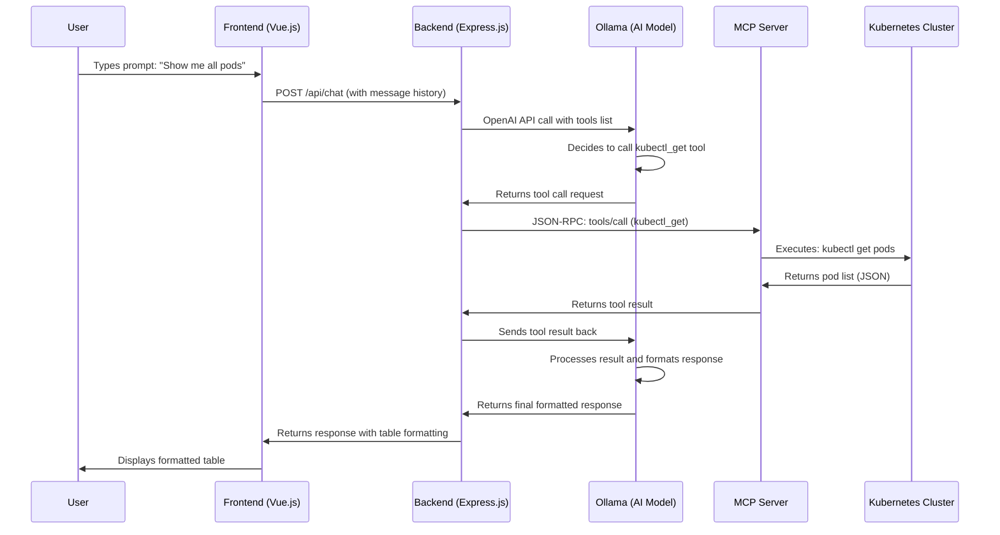

# 🔄 System Workflow & Architecture

## 📊 System Architecture Overview

```
┌─────────────────────────────────────────────────────────────────────────────────┐
│                           K8s AI Assistant System                               │
├─────────────────────────────────────────────────────────────────────────────────┤
│                                                                                 │
│  ┌─────────────────┐    ┌─────────────────┐    ┌─────────────────────────────┐  │
│  │   Frontend      │    │   Backend       │    │      MCP Server             │  │
│  │   (Rancher UI)  │◄──►│   (Express.js)  │◄──►│   (Kubernetes Tools)        │  │
│  │                 │    │                 │    │                             │  │
│  │ • Vue.js        │    │ • Express.js    │    │ • kubectl commands          │  │
│  │ • Chat Widget   │    │ • HTTP API      │    │ • Helm operations           │  │
│  │ • Table Display │    │ • SSE Client    │    │ • Port forwarding           │  │
│  │ • Logs Display  │    │ • Tool Mapping  │    │ • Resource management       │  │
│  └─────────────────┘    └─────────────────┘    └─────────────────────────────┘  │
│           │                       │                       │                      │
│           │                       │                       │                      │
│  ┌─────────────────┐    ┌─────────────────┐    ┌─────────────────────────────┐  │
│  │   Ollama        │    │   Kubernetes    │    │      Rancher Manager        │  │
│  │   (AI Model)    │    │   Cluster       │    │      (UI Platform)          │  │
│  │                 │    │                 │    │                             │  │
│  │ • gpt-oss:20b   │    │ • Pods          │    │ • Extension Framework       │  │
│  │ • Tool Calling  │    │ • Services      │    │ • UI Components             │  │
│  │ • JSON-RPC      │    │ • Deployments   │    │ • Dashboard Integration     │  │
│  └─────────────────┘    └─────────────────┘    └─────────────────────────────┘  │
└─────────────────────────────────────────────────────────────────────────────────┘
```

## 🔄 Detailed Workflow

### 1. User Input Flow

```
┌─────────────┐    ┌─────────────┐    ┌─────────────┐    ┌─────────────┐
│   User      │───►│  Frontend   │───►│  Backend    │───►│   Ollama    │
│  Types      │    │  (Vue.js)   │    │ (Express.js)│    │ (AI Model)  │
│  Prompt     │    │             │    │             │    │             │
└─────────────┘    └─────────────┘    └─────────────┘    └─────────────┘
                                                              │
                                                              ▼
┌─────────────┐    ┌─────────────┐    ┌─────────────┐    ┌─────────────┐
│   User      │◄───│  Frontend   │◄───│  Backend    │◄───│   Ollama    │
│  Sees       │    │  (Vue.js)   │    │ (Express.js)│    │ (AI Model)  │
│  Response   │    │             │    │             │    │             │
└─────────────┘    └─────────────┘    └─────────────┘    └─────────────┘
```

### 2. Tool Calling Workflow

```
┌─────────────┐    ┌─────────────┐    ┌─────────────┐    ┌─────────────┐
│   Ollama    │───►│  Backend    │───►│  MCP Server │───►│ Kubernetes  │
│  Decides    │    │  Tool       │    │  kubectl    │    │  Cluster    │
│  to Call    │    │  Mapping    │    │  Command    │    │  Resources  │
│  Tool       │    │             │    │  Execution  │    │             │
└─────────────┘    └─────────────┘    └─────────────┘    └─────────────┘
                                                              │
                                                              ▼
┌─────────────┐    ┌─────────────┐    ┌─────────────┐    ┌─────────────┐
│   Ollama    │◄───│  Backend    │◄───│  MCP Server │◄───│ Kubernetes  │
│  Receives   │    │  Formats    │    │  Returns    │    │  Returns    │
│  Tool       │    │  Response   │    │  Results    │    │  Data       │
│  Result     │    │             │    │             │    │             │
└─────────────┘    └─────────────┘    └─────────────┘    └─────────────┘
```

## 🔌 Connection Details

### Frontend ↔ Backend Connection

```javascript
// Frontend (Vue.js) → Backend (Express.js)
const response = await fetch("https://da10dc21d1f8.ngrok-free.app/api/chat", {
  method: "POST",
  headers: { "Content-Type": "application/json" },
  body: JSON.stringify({
    model: "gpt-oss:20b",
    messages: this.messages.map(msg => ({
      role: msg.role === "user" ? "user" : "assistant",
      content: msg.text
    })),
    stream: false
  })
});
```

**Protocol:** HTTP REST API  
**Port:** 8055 (Backend)  
**Format:** JSON  
**Features:**
- Message history management
- Response formatting (tables, logs)
- Error handling
- Abort controller support

### Backend ↔ Ollama Connection

```javascript
// Backend (Express.js) → Ollama
const openai = new OpenAI({
  baseURL: 'http://192.168.10.32:11434/v1',  // Ollama endpoint
  apiKey: 'ollama'
});

const completion = await openai.chat.completions.create({
  model: 'gpt-oss:20b',
  messages,
  tools: OPENAI_COMPAT_TOOLS,  // MCP tools mapped to OpenAI format
  tool_choice: 'auto'
});
```

**Protocol:** HTTP REST API  
**Port:** 11434 (Ollama)  
**Format:** OpenAI-compatible API  
**Features:**
- Tool calling support
- JSON-RPC format
- Model inference
- Response streaming

### Backend ↔ MCP Server Connection

```javascript
// Backend (Express.js) → MCP Server (HTTP + SSE)
class MCPHttpClient {
  async connect() {
    // 1. GET /sse to establish SSE connection
    const r = await fetch(`${this.base}/sse`, {
      method: 'GET',
      headers: { Accept: 'text/event-stream' }
    });
    
    // 2. Extract session endpoint from SSE events
    // 3. Use session for JSON-RPC calls
  }
  
  async rpc(method, params) {
    // POST JSON-RPC to /messages?sessionId=...
    const r = await fetch(url, {
      method: 'POST',
      headers: { 'content-type': 'application/json' },
      body: JSON.stringify({ jsonrpc: '2.0', id, method, params })
    });
  }
}
```

**Protocol:** HTTP + Server-Sent Events (SSE)  
**Port:** 3000 (MCP Server)  
**Format:** JSON-RPC 2.0  
**Features:**
- Session management
- Tool execution
- Real-time responses
- Connection recovery

### MCP Server ↔ Kubernetes Connection

```javascript
// MCP Server → Kubernetes Cluster
// kubectl commands executed via child_process
const { exec } = require('child_process');

// Example: kubectl get pods
exec('kubectl get pods --output=json', (error, stdout, stderr) => {
  // Process kubectl output
  // Return formatted results
});
```

**Protocol:** kubectl CLI  
**Authentication:** kubeconfig  
**Format:** JSON/YAML  
**Features:**
- Resource management
- Cluster operations
- Real-time data
- Error handling

## 🔄 Complete User Prompt Workflow

### Step-by-Step Process



### 1. User Input Processing

```javascript
// Frontend receives user input
async sendMessage() {
  const text = this.userInput.trim();
  this.messages.push({ role: "user", text });
  
  // Send to backend
  const res = await fetch("https://da10dc21d1f8.ngrok-free.app/api/chat", {
    method: "POST",
    headers: { "Content-Type": "application/json" },
    body: JSON.stringify({
      model: "gpt-oss:20b",
      messages: this.messages.map(msg => ({
        role: msg.role === "user" ? "user" : "assistant",
        content: msg.text
      })),
      stream: false
    })
  });
}
```

### 2. Backend Processing

```javascript
// Backend processes request
app.post('/api/chat', async (req, res) => {
  const userMessages = req.body.messages;
  
  // 1. Ensure MCP connection
  const mcp = await ensureMcp();
  
  // 2. Run tool calling loop with Ollama
  const result = await runToolCallingWithOllama({
    userMessages,
    tools: OPENAI_COMPAT_TOOLS,
    mcp,
  });
  
  return res.json({ message: { content: result.text } });
});
```

### 3. AI Model Decision

```javascript
// Ollama decides to call tools
const completion = await openai.chat.completions.create({
  model: MODEL_NAME,
  messages,
  tools,  // MCP tools mapped to OpenAI format
  tool_choice: 'auto',
});

const toolCalls = completion.choices[0]?.message?.tool_calls || [];
if (toolCalls.length > 0) {
  // Execute tool calls
  for (const tc of toolCalls) {
    const mcpRes = await mcp.toolsCall(tc.function.name, tc.function.arguments);
    // Send result back to AI
  }
}
```

### 4. MCP Tool Execution

```javascript
// MCP Server executes kubectl commands
async toolsCall(name, args) {
  return this.rpc('tools/call', { name, arguments: args });
}

// Example: kubectl get pods
// MCP Server executes: kubectl get pods --output=json
// Returns: JSON formatted pod list
```

### 5. Response Formatting

```javascript
// Backend formats response for frontend
if (reply.includes('isMarkTable:true')) {
  const { table, preamble, afterText } = this.parseMarkdownTable(tableContent);
  this.messages.push({
    role: "bot",
    text: tableContent,
    isTable: true,
    table,
    preamble,
    afterText
  });
}
```

## 🔧 Tool Mapping

### MCP Tools → OpenAI Tools

```javascript
function mapMcpToolsToOpenAITools(mcpTools) {
  return mcpTools.map((t) => ({
    type: 'function',
    function: {
      name: t.name,
      description: t.description || `MCP tool: ${t.name}`,
      parameters: t.inputSchema || { type: 'object', properties: {} },
    },
  }));
}
```

**Available Tools:**
- `kubectl_get` - Get Kubernetes resources
- `kubectl_describe` - Describe resources
- `kubectl_logs` - Get pod logs
- `kubectl_scale` - Scale deployments
- `port_forward` - Port forwarding
- `install_helm_chart` - Helm operations
- `k8s-diagnose` - Troubleshooting

## 🌐 Network Configuration

### Port Configuration

| Service | Port | Protocol | Purpose |
|---------|------|----------|---------|
| Frontend | 8005 | HTTPS | Rancher UI Extensions |
| Backend | 8055 | HTTP | Express.js API |
| MCP Server | 3000 | HTTP+SSE | Kubernetes tools |
| Ollama | 11434 | HTTP | AI model inference |
| Kubernetes | 6443 | HTTPS | API server |

### Environment Variables

```bash
# Backend Configuration
OLLAMA_BASE=http://192.168.10.32:11434/v1
MODEL_NAME=gpt-oss:20b
MCP_BASE=http://192.168.10.18:3000

# MCP Server Configuration
KUBECONFIG_PATH=/home/hatthanh/.kube/config
ENABLE_UNSAFE_SSE_TRANSPORT=true
HOST=0.0.0.0
PORT=3000

# Frontend Configuration
API=https://192.168.10.18:8005
```

## 🔄 Error Handling & Recovery

### Connection Recovery

```javascript
// MCP Client reconnection logic
async rpc(method, params = {}, id = Date.now()) {
  for (let attempt = 0; attempt <= this._maxReconnectAttempts; attempt++) {
    try {
      if (!this.sessionPath || this.connectionState !== 'connected') {
        await this.connect();
      }
      // Execute RPC call
      return await this._executeRpc(method, params, id);
    } catch (error) {
      if (this._isSessionError(error) && attempt < this._maxReconnectAttempts) {
        this.connectionState = 'reconnecting';
        this.sessionPath = null;
        await new Promise(resolve => setTimeout(resolve, this._reconnectDelay));
        continue;
      }
      throw error;
    }
  }
}
```

### Frontend Error Handling

```javascript
// Frontend error handling
try {
  const data = await res.json();
  if (data.message && data.message.content) {
    // Process successful response
  }
} catch (err) {
  if (err.name !== 'AbortError') {
    this.messages.push({ 
      role: "bot", 
      text: `❌ Lỗi kết nối: ${err.message}` 
    });
  }
}
```

## 📊 Data Flow Summary

1. **User Input** → Frontend (Vue.js)
2. **Frontend** → Backend (Express.js) via HTTP API
3. **Backend** → Ollama (AI Model) via OpenAI API
4. **Ollama** → Backend (Tool call decision)
5. **Backend** → MCP Server via JSON-RPC
6. **MCP Server** → Kubernetes via kubectl
7. **Kubernetes** → MCP Server (results)
8. **MCP Server** → Backend (formatted results)
9. **Backend** → Ollama (tool results)
10. **Ollama** → Backend (final response)
11. **Backend** → Frontend (formatted response)
12. **Frontend** → User (displayed result)

This architecture provides a robust, scalable system for AI-powered Kubernetes management with real-time tool execution and user-friendly interface.